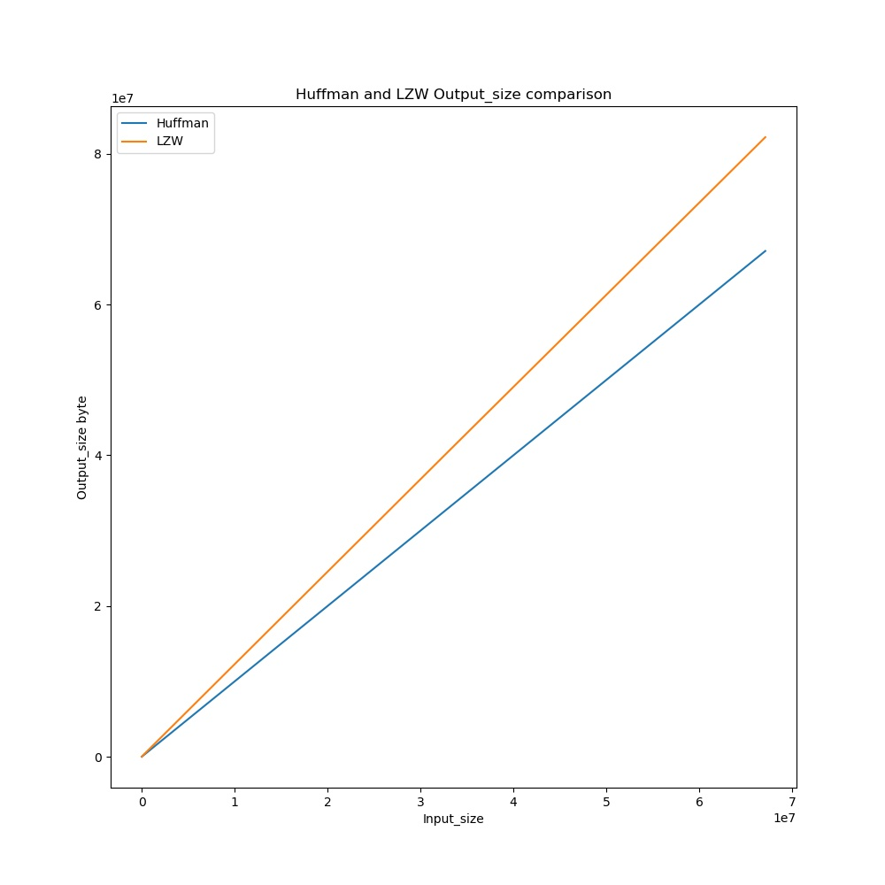
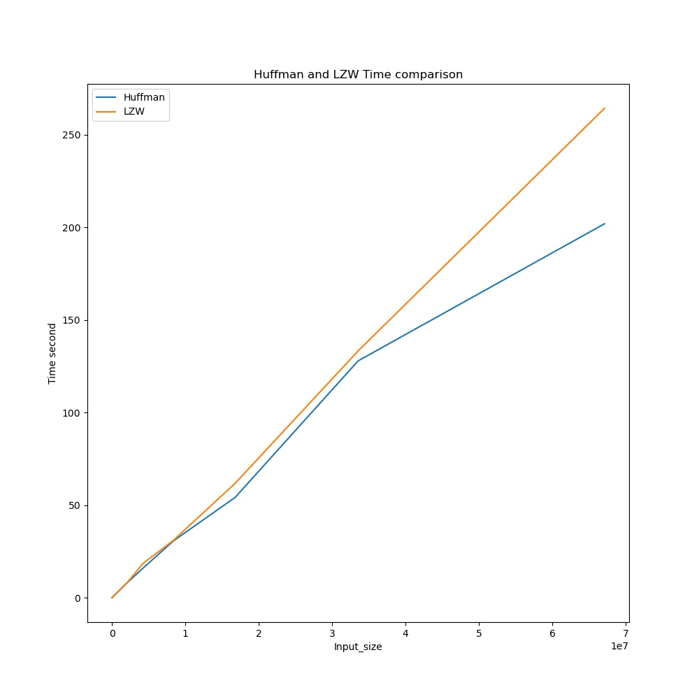
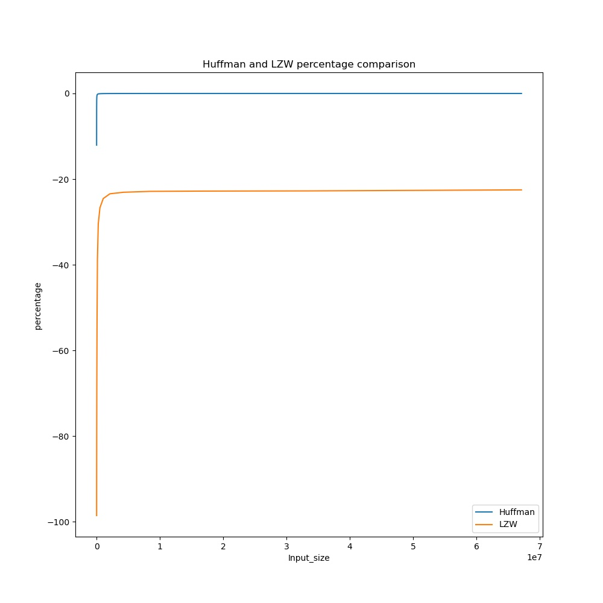
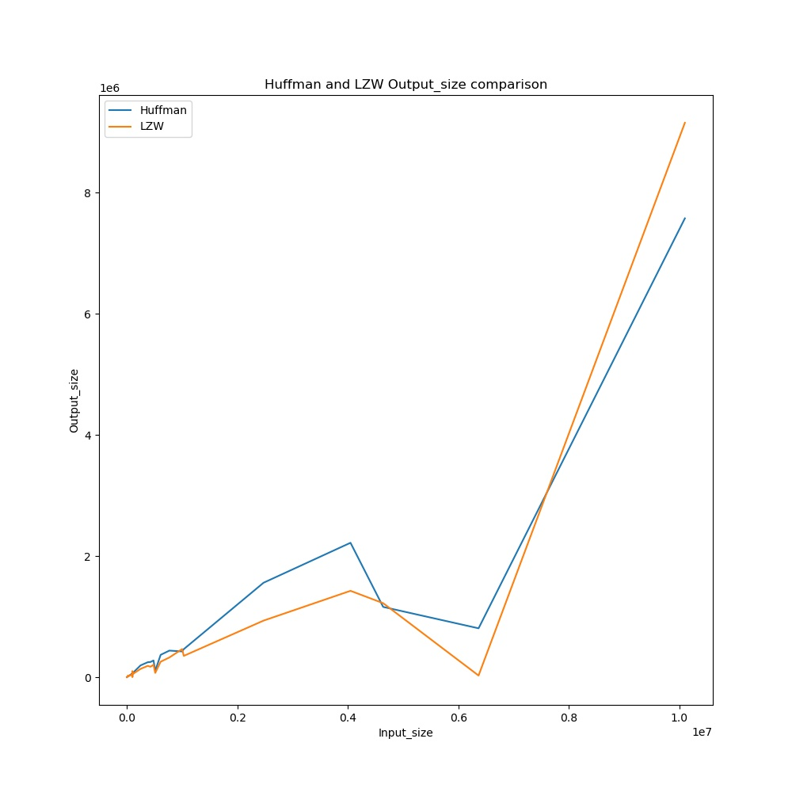
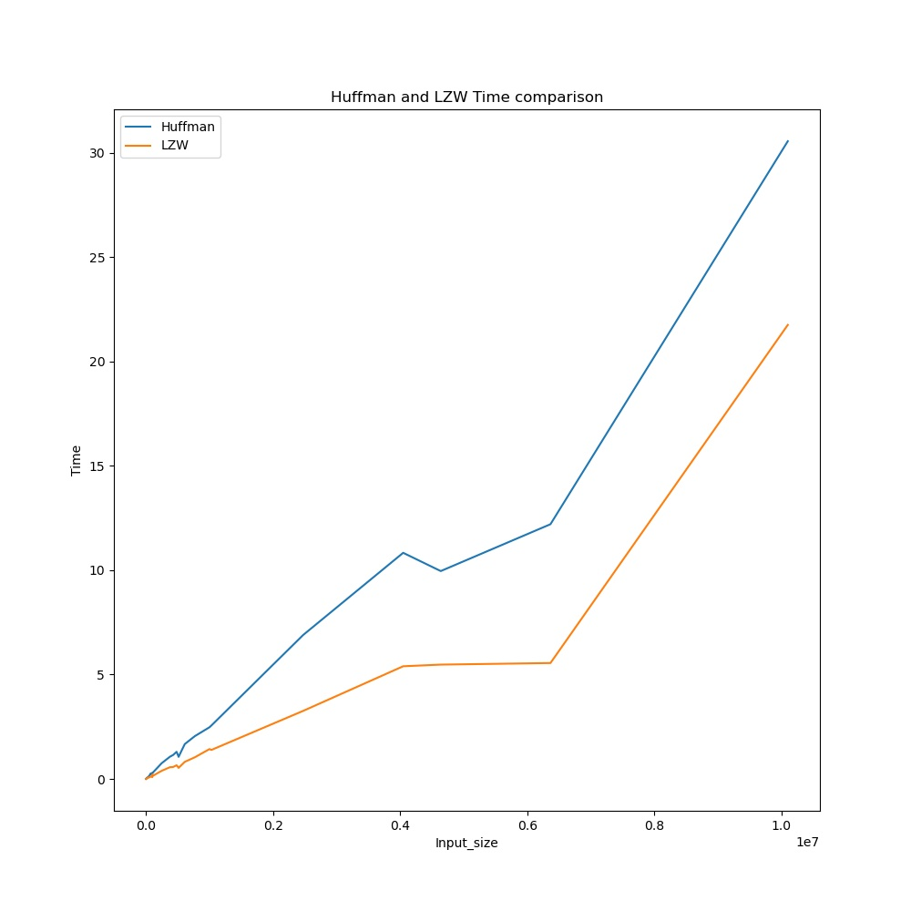
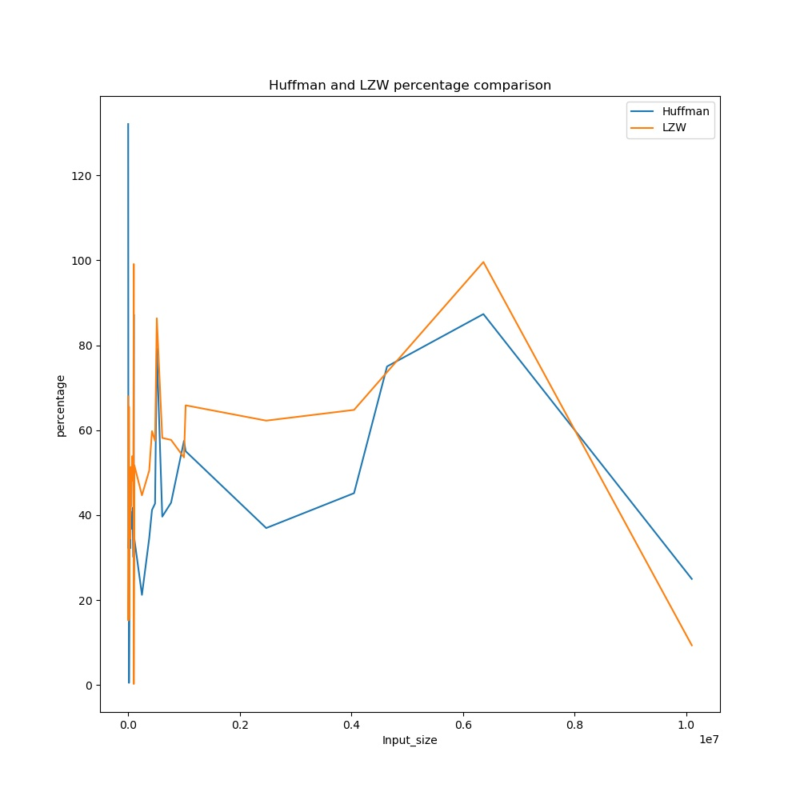

# CompressIt


## What is CompressIt ?
CompressIt compresses the file using huffman or LZW algorithm. 

## How to build ?
```shell
make
```

## Usage
```shell
./compressit [OPTION]... [FILE]...
```  
<strong> The outputof the The program will be in following format.

\[INPUT FILE NAME], \[INPUT FILE SIZE], \[OUTPUT FILE SIZE], \[TIME ELAPSED] </strong>


## Aim of CompressIt 
The aim of the CompressIt is to compare runtime as well as compression ratio
of huffman and LZW algorithm.  
Also determining for what kind of data these algorithm are effective


## How to compare Huffman and LZW algorithm ?

### Generating result files  
shell script [./tools/generate_data.sh](tools/generate_data.sh) Generates The result file for the given list of files
```shell
./tools/generate_data.sh file1 file2 ...
```
The data file for huffman algorithm will be stored in result_huff.txt
And for LZW algorithm will be stored in result_lzw.txt

### Plotting result files  
python script [./tools/plot.py](tools/plot.py) plots the data using matplotlib and pandas.
```shell
./tools/plot.py result_huff.txt result_lzw.txt
``` 

This will produce following graph files
|File name						|Graph data														 |	
|---------						|----------														 |
|Input_size_Output_size.jpg  	 |plot of size of original file vs compressed file   			   	|
|Input_size_Time.jpg			 | plot of size of original file vs time required for compression	|
|Input_size_percentage.jpg 		 | plot of size of original file vs percentage compression 			|

## Time complexity 
The Time complexity of Huffman is **O(n)** for compression as well as decompression, Whereas Time complexity of LZW is **O(n)** for compression and **O(n * m / _&alpha;_)** for decompression, where *n* is file size in bytes, *m* is total key:values store in hashmap and *_&alpha;_* is the total slots in chained hashmap 

see [TIMECOMPLEXITY.md](TIMECOMPLEXITY.md) for more details


## Results

### Compression results based on random data




### Compression results based on Pattern data




## Observation
The observation of uncompressed size vs compressed file for both forms of data are completely opposite.
* Observations for random data byte files:
	* For Random data LZW and huffman both expands the file. 
	* Huffman performs better and is faster than LZW.
	* Percentage of data compressed is negative.
* Observations for Pattern data byte files:
	* Most of the files are better compressed by LZW than Huffman.
	* LZW turns out be faster than huffman. 
	* Percentage of data compressed reduces as file size increases.

## Interpretation
read [interpret.md](./results/INTERPRET.md) for interpretation of each observation

## Conclusion
read [conclusion.md](./results/CONCLUSION.md) for conclusion


